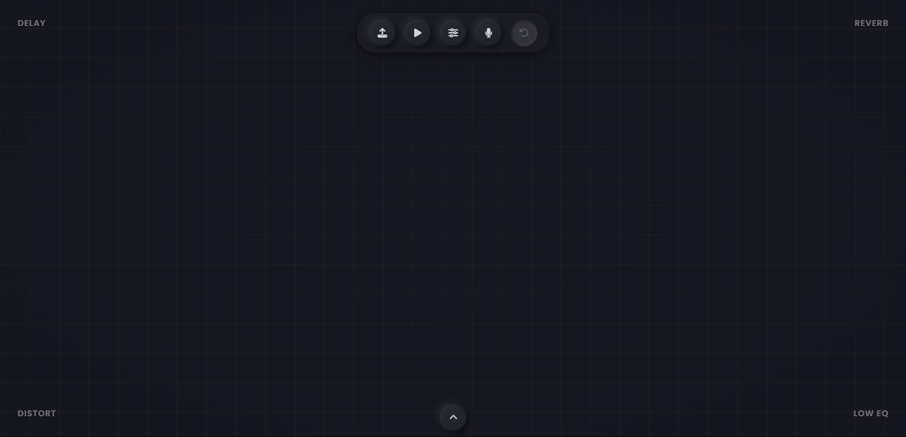

# Deluloop
An improvisational looper, powered by [JASCO](https://github.com/facebookresearch/audiocraft/blob/main/docs/JASCO.md).

## Usage
- Request access to [JASCO Chords Drums](https://huggingface.co/facebook/jasco-chords-drums-400M) on Hugging Face.
- Add Hugging Face API key as an environment variable named HF_KEY
- Install requirements with ``pip install -r requirements.txt``
- Run server with ``python app.py``
- Run client with ``index.html``

## License
The license for JASCO weights can be found [here](https://github.com/facebookresearch/audiocraft/blob/896ec7c47f5e5d1e5aa1e4b260c4405328bf009d/LICENSE_weights).

## Features
1. Currently, you can upload an audio file, record via mic input live, and prompt for LLM.

2. Once audio is fed via these formats, its brought in as a track with the form of a puck.

3. You can move the puck in the given space and create a unique blend based on the position.

4. By default collisions and physics is triggered on- feel free to turn it off

5. Draw paths for pucks to move around in the space- adding automation to the effects. This happens in a loop

6. You can also connect pucks to group them together. So you could group specific audio loops together- the pucks also move together when a puck is connected and in path mode

7. The interface is designed with improvisation in mind so it doesn't revert back to anymore than 1 undo back

## Controls + Shortcuts
Volume up/down- mouse scroll up or down while hovering over a puck
Pause the puck- Double click on the specific puck to pause it
Select a puck- left mouse click the puck
Grab the puck- left mouse click and hold to drag around
Play audio in reverse- right mouse click on top of a puck
Group similar pucks together by connecting them- ctrl/cmd + left mouse click 
Disconnect one of the grouped pucks- ctrl/cmd + right mouse click
Draw a path- shift + right mouse click and drag in a specific path to set automation
Get out of the drawn path- shift + left mouse click, either on the path or the puck
pause the entire performance- spacebar
ctrl+c/v/d/x/z- copy and paste, duplicate, delete, bring back a selected puck

